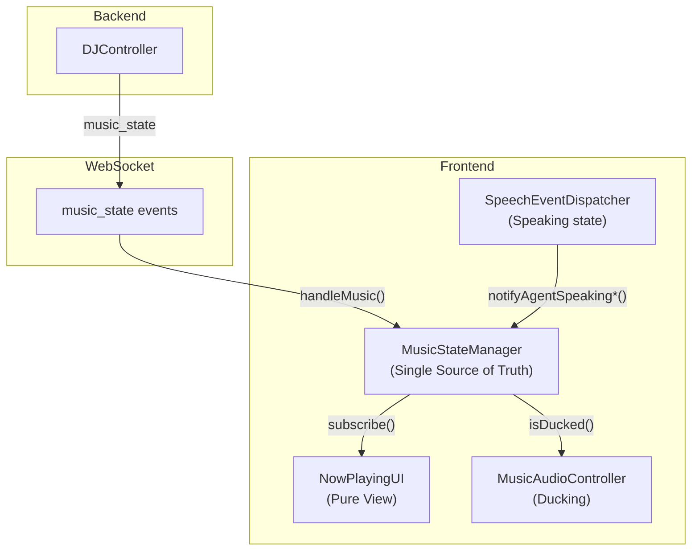

# VoiceAI Frontend Design Standards

> **We believe in making AI human, and the decisions we make will reflect that.**

The frontend is where users experience our AI. Every design choice should make interactions feel warm, personal, and genuinely human. See `../CORE-PRINCIPLES.md` for our complete philosophy.

---

## Quick Reference - Quality Commands

```bash
# Before committing (runs automatically via pre-commit hook)
npm run quality          # Typecheck + lint + tokens + test

# Full audit (run periodically)
npm run quality:full     # All checks + UI audit

# Individual checks
npm run typecheck        # TypeScript only
npm run lint:tokens      # Design token validation
npm run audit:ui         # UI accessibility/consistency audit
npm run lint:fix         # Auto-fix ESLint issues
```

## Automated Quality Gates

### Pre-commit Hook (Automatic)
Every commit runs `lint-staged` which:
- ESLint + auto-fix on `.ts/.tsx` files
- Prettier formatting on all files
- **Design token validation on UI files (BLOCKING)**

### CI Pipeline (GitHub Actions)
| Check | Blocking? | Threshold |
|-------|-----------|-----------|
| TypeScript | Yes | 0 errors |
| ESLint | Yes | 0 errors |
| Design Tokens | Yes | 0 violations |
| Tests | Yes | All pass |
| UI Audit Errors | Yes | 0 errors |
| UI Audit Warnings | No | Report only |
| File Size | No | Report files >500 lines |

---

## Core Principles

### Professional Visual Standards

**NO EMOJIS** - Never use emojis in any UI implementation. Use:
- SVG icons for visual indicators
- CSS shapes and animations for decorative elements
- Typography and spacing for hierarchy

**Typography First** - Proper font weights, sizes, and spacing communicate hierarchy better than decorative elements.

**Restraint Over Excess** - When in doubt, remove visual elements. Every pixel must earn its place.

---

## Design System Integration

### Token Usage (ENFORCED)

Always use design system tokens. Hardcoded values will **block commits**.

```css
/* Correct */
color: var(--color-text-primary);
background: var(--color-bg-secondary);
padding: var(--space-md);
z-index: var(--z-modal);

/* Incorrect - WILL BLOCK COMMIT */
color: #ffffff;
background: #1a1a2e;
padding: 16px;
z-index: 9999;
```

### Z-Index Scale (REQUIRED)

Use semantic z-index tokens instead of arbitrary values:

```css
--z-base: 0;              /* Default stacking */
--z-raised: 1;            /* Within-component layering */
--z-content: 10;          /* Content elements (waveforms) */
--z-floating: 20;         /* Floating elements */
--z-overlay: 30;          /* Local overlays */
--z-sticky: 100;          /* Sticky headers, nav */
--z-dropdown: 1000;       /* Dropdowns, tooltips */
--z-modal-backdrop: 2000; /* Modal backdrop */
--z-modal: 2100;          /* Modal content */
--z-modal-elevated: 2200; /* Above modals (close buttons) */
--z-notification: 3000;   /* Toast notifications */
--z-loading: 4000;        /* Loading overlays */
--z-system: 9999;         /* Critical system UI (splash) */
```

### Color Tokens

- **Backgrounds**: `--color-bg-*` (primary, secondary, tertiary, elevated, glass)
- **Text**: `--color-text-*` (primary, secondary, muted, dimmed)
- **Borders**: `--color-border-*` (subtle, medium)
- **Accents**: `--color-accent-*` (sparingly for interactive elements)
- **Semantic**: `--color-semantic-*` (success, error, warning)

### Spacing Tokens

```css
--space-2xs: 0.125rem;  /* 2px */
--space-xs: 0.25rem;    /* 4px */
--space-sm: 0.5rem;     /* 8px */
--space-md: 1rem;       /* 16px - Base */
--space-lg: 1.618rem;   /* 26px */
--space-xl: 2.618rem;   /* 42px */
```

### Animation Tokens

```css
/* Durations */
--duration-fast: 150ms;
--duration-normal: 200ms;
--duration-slow: 300ms;

/* Easing */
--ease-out-expo: cubic-bezier(0.16, 1, 0.3, 1);
--ease-spring: cubic-bezier(0.5, 1.5, 0.5, 1);
```

---

## Component Guidelines

### Buttons
- Minimum touch target: 44px
- Clear hover/active/focus states
- Use `--radius-full` for primary, `--radius-lg` for secondary

### Focus States (REQUIRED for Accessibility)
```css
:focus-visible {
  outline: 2px solid var(--color-accent-primary);
  outline-offset: 2px;
}

/* If you have :hover, you MUST have :focus */
.button:hover { background: var(--color-bg-elevated); }
.button:focus-visible { background: var(--color-bg-elevated); }
```

### Error Handling (REQUIRED)
```typescript
// WRONG - Will fail UI audit
audio.play().catch(() => {});

// CORRECT
audio.play().catch((e) => {
  if (import.meta.env?.DEV) console.debug('Audio blocked:', e);
});
```

### Reduced Motion (REQUIRED for animations)
```css
@media (prefers-reduced-motion: reduce) {
  .animated-element {
    animation: none;
    transition: none;
  }
}
```

### API Response Pattern (CRITICAL)

The `apiGet`, `apiPost`, `apiDelete` utilities return a **wrapper object**, NOT the raw data:

```typescript
// Return type: { ok: boolean; data?: T; error?: string; status: number; ... }

// ✅ CORRECT - Check ok and access .data
async function getProfile(): Promise<Profile> {
  const response = await apiGet<Profile>('/api/profile');
  if (!response.ok || !response.data) {
    throw new Error(response.error || 'Failed to get profile');
  }
  return response.data;  // ← The actual Profile object
}

// ❌ WRONG - Returning the wrapper causes type errors
async function getProfile(): Promise<Profile> {
  const response = await apiGet<Profile>('/api/profile');
  return response;  // ← This is the wrapper, NOT Profile!
}
```

**Pattern for services:**
1. Call `apiGet<T>()` / `apiPost<T>()` / `apiDelete<T>()`
2. Check `response.ok` and `response.data`
3. Return `response.data` (the unwrapped typed data)
4. Handle errors via `response.error`

See `src/utils/api.ts` for full documentation.

### Result Types (USE THESE)

Use standardized result types instead of inline `{ success: boolean; error?: string }`:

```typescript
import { OperationResult, SyncResult, success, failure } from '../types/index.js';

// ✅ CORRECT - Named type with factory functions
async function saveProfile(): Promise<OperationResult> {
  try {
    await api.save();
    return success();
  } catch (e) {
    return failure(e);
  }
}

// ✅ With data payload
async function syncCalendar(): Promise<SyncResult> {
  const count = await doSync();
  return { success: true, count };
}

// ❌ WRONG - Inline types are inconsistent and lack docs
async function saveProfile(): Promise<{ success: boolean; error?: string }> { ... }
```

**Available types** (see `src/types/results.ts`):
- `OperationResult` - Basic success/error
- `OperationResultWith<T>` - Success with data payload
- `SyncResult` - Sync operations with count
- `ValidationResult` - Validation with errors/warnings
- `ConnectionResult` - Auth/connection status
- `PurchaseResult` - Transaction results

**Helpers:**
- `success()` / `success(data)` - Create success result
- `failure(error)` - Create failure result
- `isSuccess(result)` / `isFailure(result)` - Type guards

### Result Monad (Functional Error Handling)

For complex async operations, use the full `Result<T, E>` monad (mirrors backend pattern):

```typescript
import { Result, ok, err, isOk, isErr, AsyncResult } from '../types/index.js';
import { ApiError, ValidationError } from '../types/index.js';

// ✅ Return type makes errors explicit
async function fetchUser(id: string): AsyncResult<User, ApiError> {
  const response = await apiGet<User>(`/api/users/${id}`);
  if (!response.ok || !response.data) {
    return err(new ApiError(response.error || 'Not found', response.status));
  }
  return ok(response.data);
}

// ✅ Handle with pattern matching
const result = await fetchUser('123');
if (isOk(result)) {
  console.log(result.value.name);  // TypeScript knows it's User
} else {
  showError(result.error.message); // TypeScript knows it's ApiError
}
```

**Available utilities** (see `src/types/result.ts`):
- `ok(value)` / `err(error)` - Constructors
- `isOk(result)` / `isErr(result)` - Type guards
- `unwrapOr(result, default)` - Get value or default
- `map(result, fn)` - Transform success value
- `chain(result, fn)` - Flatmap for chaining
- `fromPromise(promise)` - Convert throwing promise
- `combine([results])` - Collect array of results

### Branded Types (Type-Safe IDs)

Prevent ID mix-ups at compile time:

```typescript
import { UserId, SessionId, createUserId, createSessionId } from '../types/index.js';

// ✅ These are NOT interchangeable
function getUser(userId: UserId): Promise<User> { ... }
function getSession(sessionId: SessionId): Promise<Session> { ... }

const userId = createUserId(firebaseUid);
const sessionId = createSessionId(roomName);

getUser(userId);      // ✅ OK
getUser(sessionId);   // ❌ Type error! SessionId is not assignable to UserId
```

**Available branded types** (see `src/types/branded.ts`):
- **IDs**: `UserId`, `SessionId`, `PersonaId`, `DeviceId`, `ContactId`, `MemoryId`
- **Numeric**: `Timestamp`, `DurationMs`, `Percentage`, `CentsAmount`
- **Factory functions**: `createUserId()`, `createSessionId()`, etc.

### Zod Schemas (Runtime Validation)

Validate external data at boundaries:

```typescript
import { z } from 'zod';
import { parseWithErrors, safeValidate } from '../types/index.js';

// 1. Define schema (source of truth)
const UserSchema = z.object({
  id: z.string(),
  email: z.string().email(),
  name: z.string().min(1),
});

// 2. Infer type (never write types manually!)
type User = z.infer<typeof UserSchema>;

// 3. Validate at API boundary
const result = safeValidate(UserSchema, apiResponse);
if (result.ok) {
  const user = result.value; // Fully typed User!
}
```

**Available schemas** (see `src/types/schemas.ts`):
- `LiveKitTokenSchema` - LiveKit token validation
- `UserProfileSchema` - User data
- `HealthStatusSchema`, `HealthDataPointSchema` - Health data
- `ContactFormSchema`, `SettingsFormSchema` - Form validation
- `UserIdSchema`, `SessionIdSchema`, `PersonaIdSchema` - ID validation

**Utilities:**
- `parseWithErrors(schema, data, context)` - Parse or throw with context
- `safeValidate(schema, data)` - Returns `{ ok, value/error }`
- `readLocalStorage(schema, key)` - Validated localStorage reads
- `parseSearchParams(schema, search)` - Validated URL params

### Inline Result Pattern Linter

Detect and flag inline `{ success: boolean }` patterns:

```bash
npm run lint:result-types        # Check for inline patterns
npm run lint:result-types --fix  # Show suggested replacements
```

### Defensive Programming Utilities

Use guards to catch bugs early and make assumptions explicit:

```typescript
import {
  assertNever,
  invariant,
  assertDefined,
  compact,
  safeGet,
} from '../utils/guards.js';

// ✅ Exhaustive switch - compile error if new case added
type Status = 'pending' | 'active' | 'done';
function getLabel(status: Status): string {
  switch (status) {
    case 'pending': return 'Waiting...';
    case 'active': return 'In progress';
    case 'done': return 'Complete!';
    default:
      return assertNever(status); // Compile error if case missed!
  }
}

// ✅ Runtime assertions - fail fast with clear messages
function processUser(userId: string | null): void {
  invariant(userId, 'User ID is required');
  // userId is now string, not string | null
}

// ✅ Safe array access
const items = ['a', 'b', 'c'];
const first = safeGet(items, 0); // string | undefined
if (first) {
  // TypeScript knows first is string
}

// ✅ Filter nulls with proper types
const mixed = [user1, null, user2, undefined];
const users = compact(mixed); // User[]
```

**Available guards** (see `src/utils/guards.ts`):
- `assertNever(value)` - Exhaustive check for discriminated unions
- `invariant(condition, message)` - Runtime assertion
- `assertDefined(value, message)` - Non-null assertion
- `compact(array)` - Filter null/undefined from array
- `safeGet(array, index)` - Safe array access
- `isNonEmptyString(value)` - Type guard for non-empty strings
- `isPlainObject(value)` - Type guard for plain objects

---

## File Size Limits

| Type | Limit | Action |
|------|-------|--------|
| UI component | 500 lines | Split into modules |
| Any `.ts` file | 500 lines | Refactor |

Files exceeding limits are flagged in PR reports.

---

## Validation Scripts

### Design Token Validator (`npm run lint:tokens`)
Scans `src/ui/` for:
- Hardcoded colors (`#fff`, `rgb()`, `rgba()`)
- Hardcoded fonts
- Hardcoded shadows
- Hardcoded blur values
- Hardcoded durations

**Exceptions** (automatically skipped):
- Theme override blocks (`[data-theme="zen"]`)
- Canvas/programmatic colors (`fillStyle`, `strokeStyle`)
- Dev tools (`dev-panel.ui.ts`)
- Color arrays for animations

### UI Audit (`npm run audit:ui`)
Scans for:
- **Accessibility**: Missing aria-labels, focus styles, reduced-motion
- **States**: Empty catch blocks, missing loading states
- **Responsiveness**: Hardcoded pixel widths
- **Consistency**: Hardcoded z-index values
- **Performance**: Animating expensive properties

---

## Workflow

### Before Starting Work
```bash
git pull
npm install
npm run quality  # Ensure clean baseline
```

### During Development
- Use tokens for all values
- Add focus styles with hover styles
- Handle errors properly (no empty catch)
- Keep files under 500 lines

### Before Committing
```bash
npm run quality:full  # Full check
git add .
git commit -m "feat: description"
# Pre-commit hook runs automatically
```

### If Pre-commit Fails
1. Check the error message
2. Fix token violations: Replace hardcoded values with `var(--token-name)`
3. Fix lint errors: Run `npm run lint:fix`
4. Re-run `npm run quality` to verify
5. Commit again

---

## Dev Panel Access 🛠️

The dev panel provides testing tools for personas, celebrations, tiers, and more.

| Environment | Access Method |
|-------------|---------------|
| **Development** | `?dev` URL param or `Cmd/Ctrl+Shift+D` |
| **Production** | `?dev=ferni2024` (or custom key via `VITE_DEV_PANEL_KEY`) |
| **Admin Deploy** | Set `VITE_DEV_PANEL_AUTO=true` in .env → always enabled! |

Once authenticated, toggle with `Cmd/Ctrl+Shift+D`. See `README.md` for full details.

---

## Architecture Overview

### Module Structure

The frontend follows a modular architecture with clear separation of concerns:

```
src/
├── app/                 # Application orchestration
│   ├── panel-methods.ts    # Panel show/hide functions
│   ├── data-message-handlers.ts  # Backend message processing
│   └── brand-integration.ts      # Brand system hooks
├── eq/                  # Emotional Intelligence System
│   ├── capabilities/   # Five EQ capabilities
│   │   ├── micro-expressions.ts
│   │   ├── active-listening.ts
│   │   ├── breath-sync.ts
│   │   ├── concern-detection.ts
│   │   └── anticipation.ts
│   ├── bridge/         # Backend signal handlers
│   │   └── humanization-bridge.ts
│   ├── state/          # Emotion state management
│   │   ├── emotion-machine.ts
│   │   ├── emotion-groups.ts
│   │   └── emotion-interpolator.ts
│   ├── utils/          # Shared utilities
│   └── index.ts        # Public API
├── components/          # Reusable UI components
│   └── base/           # Foundation components
│       ├── component.ts  # BaseComponent class
│       ├── modal.ts      # Modal component
│       └── panel.ts      # Panel component
├── services/            # Business logic
├── state/               # Application state
├── ui/                  # UI implementations
└── utils/               # Shared utilities
```

### EQ System (Emotional Intelligence)

The `eq/` module implements Ferni's "Better than Human" emotional intelligence:

```typescript
import { ferni, initFerniEQ } from './eq/index.js';

// Initialize on app start
initFerniEQ();

// Use EQ capabilities
ferni.playMicroExpression('recognition');      // 40-150ms subliminal flash
ferni.startActiveListening();                   // Micro-nods during user speech
ferni.setBreathSyncEnabled(true);              // Sync with user breathing
ferni.analyzeConcern({ transcript, voiceStrain }); // Detect distress
ferni.anticipateEmotion({ transcript, tone });  // Predict emotions
```

**Key files:**
- `eq/index.ts` - Public API with lazy-loaded `ferni` object
- `eq/capabilities/*.ts` - Individual EQ capability implementations
- `eq/bridge/humanization-bridge.ts` - Backend signal handlers

### Component System

Use the base components for consistent, brand-compliant UI:

```typescript
import { Modal, Panel, BaseComponent } from './components/base/index.js';

// Modal (centered floating)
class MyModal extends Modal {
  constructor() {
    super({
      title: 'My Title',
      eyebrow: 'SECTION',
    }, {
      closeOnBackdropClick: true,
      closeOnEscape: true,
    });
  }

  protected override buildContent(): string {
    return `<p>Dynamic content here</p>`;
  }
}

// Panel (slides from right)
class MyPanel extends Panel {
  constructor() {
    super({
      title: 'Settings',
      showBackButton: true,
    });
  }
}

// Usage
const modal = new MyModal();
modal.mount(document.body);
modal.open();
```

**BaseComponent features:**
- Lifecycle management (`mount`, `afterMount`, `dispose`)
- Event listener tracking (prevents memory leaks)
- HMR protection (`cleanupOrphanedElements`)
- Style injection utilities

### App Module

The `app/` module contains orchestration utilities used by `app.ts`:

```typescript
// Panel methods (show various UI panels)
import { showAnalyticsDashboard, showTeamHuddle } from './app/panel-methods.js';

// Data message handlers (process backend messages)
import { handleDataMessage } from './app/data-message-handlers.js';

// Brand integration (theming hooks)
import { onBrandChange } from './app/brand-integration.js';
```

### Backward Compatibility

All existing imports continue to work via re-export shims:
- `better-than-human.ui.ts` → re-exports from `eq/`
- Direct `app.ts` imports → still available

### Music System Architecture (January 2026)

The frontend music system uses a **single source of truth** pattern that mirrors the backend DJController:

```
Backend DJController → music_state events → MusicStateManager → UI Components
```



**Key files:**

| File | Purpose |
|------|---------|
| `services/music-state-manager.ts` | Single source of truth for music state |
| `ui/now-playing.ui.ts` | Pure view - subscribes to MusicStateManager |
| `services/music-audio.controller.ts` | Web Audio ducking with CSS fallback |
| `services/speech-event-dispatcher.ts` | Notifies MusicStateManager of speaking |
| `app/data-message-handlers.ts` | Routes backend events to MusicStateManager |
| `ui/music-history.ui.ts` | Recently played tracks drawer |
| `ui/music-dashboard.ui.ts` | Musical insights dashboard |

**State flow:**

1. Backend sends `music_state` event via data channel
2. `handleMusic()` in `data-message-handlers.ts` passes to `MusicStateManager`
3. `MusicStateManager` updates state and emits typed events
4. `NowPlayingUI` receives events via subscription and updates view
5. Control buttons send commands back to backend (no optimistic updates)
6. Backend confirms state change via new `music_state` event

**Ducking coordination:**

1. `SpeechEventDispatcher` detects agent/user speaking
2. Notifies `MusicStateManager.notifyAgentSpeakingStart/End()`
3. `MusicStateManager` emits `ducking_started/ended` events
4. `MusicAudioController` applies volume ducking (Web Audio or CSS fallback)

**Key patterns:**

- **NO optimistic updates** - Control buttons wait for backend confirmation
- **Pure views** - UI subscribes to state, doesn't manage it
- **Fallback ducking** - CSS volume when Web Audio fails
- **Stale detection** - Heartbeat resets state if backend goes silent

---

## Summary

1. **Use tokens** - Hardcoded values block commits
2. **Use z-index scale** - No arbitrary z-index values
3. **Add focus styles** - Every :hover needs :focus
4. **Handle errors** - No empty catch blocks
5. **Keep files small** - Max 500 lines
6. **Run quality checks** - `npm run quality` before commits
7. **No emojis** - Use SVG icons
8. **Use Result types** - No inline `{ success: boolean }` patterns
9. **Use branded IDs** - `UserId`, `SessionId` prevent mix-ups
10. **Validate at boundaries** - Use Zod schemas for external data
11. **Use assertNever** - Exhaustive switch/if checks for unions
12. **Use invariant** - Make runtime assumptions explicit
13. **Use eq/ module** - For all emotional intelligence features
14. **Use BaseComponent** - For new modals/panels (see `components/base/`)
