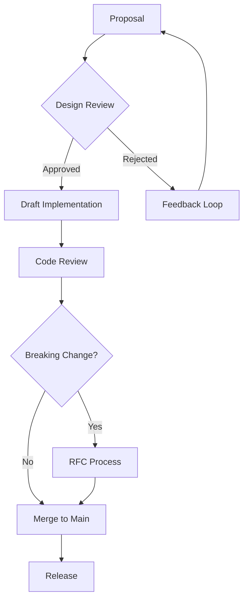

# ⚙️ Ferni Design Ops
## Process, Automation & Governance

**Version 1.0 | December 2024**

---

> *"The best design systems aren't just documented—they're enforced."*

---

# Table of Contents

1. [Philosophy](#1-philosophy)
2. [Token Pipeline](#2-token-pipeline)
3. [Component Governance](#3-component-governance)
4. [Quality Automation](#4-quality-automation)
5. [Brand Compliance CI](#5-brand-compliance-ci)
6. [Documentation System](#6-documentation-system)
7. [A/B Testing Framework](#7-ab-testing-framework)
8. [Version Management](#8-version-management)
9. [Cross-Platform Sync](#9-cross-platform-sync)
10. [Metrics & Analytics](#10-metrics--analytics)

---

# 1. Philosophy

## Why Design Ops?

Design systems fail when they're:
- Only documented, not enforced
- Static, not evolving
- Siloed, not shared
- Optional, not integrated

**Ferni Design Ops ensures the brand stays consistent at scale.**

### Our Approach

| Problem | Solution |
|---------|----------|
| Hardcoded values | Token pipeline that generates code |
| Brand drift | CI checks that enforce compliance |
| Inconsistent components | Single source of truth |
| Stale docs | Auto-generated documentation |
| Guesswork | A/B testing framework |

---

# 2. Token Pipeline

## 2.1 Single Source of Truth

All design values live in JSON tokens:

```
design-system/
├── tokens/
│   ├── colors.json        # Color primitives + semantics
│   ├── typography.json    # Font families, sizes, weights
│   ├── spacing.json       # Space scale
│   ├── animation.json     # Durations, easings
│   ├── shadows.json       # Elevation system
│   ├── radii.json         # Border radius scale
│   └── personas.json      # Persona-specific tokens
```

## 2.2 Token Build Process

```bash
npm run build:tokens
```

**Process:**
1. Read all JSON token files
2. Validate against schema
3. Generate outputs for each platform
4. Run post-processing (minification, tree-shaking)

**Outputs:**
```
design-system/dist/
├── tokens.css             # CSS variables
├── tokens.ts              # TypeScript constants
├── tokens.json            # JSON (for tooling)
├── tokens.swift           # iOS (Swift)
├── tokens.kt              # Android (Kotlin)
└── figma-tokens.json      # Figma plugin format
```

## 2.3 Token Schema

```typescript
// tokens/schema.ts
interface ColorToken {
  value: string;           // Hex, RGB, or HSL
  type: 'color';
  description?: string;
  category: 'primitive' | 'semantic' | 'persona';
  darkMode?: string;       // Dark theme override
}

interface SpacingToken {
  value: number;           // Pixels
  type: 'spacing';
  scale: 'base' | 'ma';    // Base scale or 'Ma' scale
}

interface AnimationToken {
  value: number | string;
  type: 'duration' | 'easing';
  description?: string;
}
```

## 2.4 Token Validation

```typescript
// Validation rules
const VALIDATION_RULES = {
  colors: {
    // Must be valid hex, RGB, or HSL
    pattern: /^(#[0-9A-Fa-f]{6}|rgb\(|hsl\()/,
    // Semantic colors must reference primitives
    semanticMustReference: true,
  },
  spacing: {
    // Must be multiple of 4
    multipleOf: 4,
    // Max value
    maxValue: 384,
  },
  animation: {
    // Duration must be positive
    minDuration: 0,
    // Max duration for accessibility
    maxDuration: 5000,
  },
};
```

---

# 3. Component Governance

## 3.1 Component Registry

All components tracked in central registry:

```typescript
// component-registry.json
{
  "components": [
    {
      "name": "Button",
      "status": "stable",
      "version": "2.1.0",
      "owner": "design-system",
      "platforms": ["web", "ios", "android"],
      "tokens": ["colors.semantic.action", "spacing.4", "radii.full"],
      "a11y": {
        "wcag": "AA",
        "tested": true,
        "notes": "Focus ring, touch targets"
      },
      "docs": "/components/button"
    }
  ]
}
```

## 3.2 Component Status Lifecycle

```
proposal → draft → review → stable → deprecated → removed

Proposal: Idea documented, not implemented
Draft: Initial implementation, breaking changes expected
Review: Feature complete, gathering feedback
Stable: Production ready, follows semver
Deprecated: Will be removed, migration guide available
Removed: No longer available
```

## 3.3 Component Ownership

| Owner | Components |
|-------|------------|
| **design-system** | Button, Card, Input, Modal, Toast |
| **voice-team** | Avatar, Waveform, ConnectionStatus |
| **trust-team** | TrustRing, MilestoneCard, StreakIndicator |
| **persona-team** | PersonaCard, HandoffTransition |

## 3.4 Change Process



---

# 4. Quality Automation

## 4.1 Pre-commit Hooks

```bash
# .husky/pre-commit
npm run lint:tokens      # Validate token files
npm run lint:brand       # Check brand compliance
npm run lint:a11y        # Accessibility checks
npm run test:visual      # Visual regression
```

## 4.2 Token Linting

```typescript
// scripts/lint-tokens.ts
export function lintTokens() {
  const errors: LintError[] = [];
  
  // Check for hardcoded colors
  const cssFiles = glob.sync('src/**/*.css');
  for (const file of cssFiles) {
    const content = fs.readFileSync(file, 'utf-8');
    const hardcodedColors = content.match(/#[0-9A-Fa-f]{6}/g);
    if (hardcodedColors) {
      errors.push({
        file,
        message: `Hardcoded colors found: ${hardcodedColors.join(', ')}`,
        rule: 'no-hardcoded-colors',
      });
    }
  }
  
  // Check for hardcoded durations
  const tsFiles = glob.sync('src/**/*.ts');
  for (const file of tsFiles) {
    const content = fs.readFileSync(file, 'utf-8');
    const hardcodedDurations = content.match(/duration:\s*\d+(?!.*DURATION)/g);
    if (hardcodedDurations) {
      errors.push({
        file,
        message: 'Hardcoded duration found. Use DURATION constants.',
        rule: 'no-hardcoded-durations',
      });
    }
  }
  
  return errors;
}
```

## 4.3 Brand Compliance Linting

```typescript
// scripts/lint-brand.ts
const BRAND_RULES = {
  noConsoleLog: {
    pattern: /console\.(log|warn|error|debug)/,
    message: 'Use createLogger() instead of console',
    severity: 'error',
  },
  noPurpleColors: {
    pattern: /#(800080|9b59b6|8b5cf6|a855f7)/i,
    message: 'Purple is not a Ferni brand color',
    severity: 'error',
  },
  noEmoji: {
    pattern: /[\u{1F600}-\u{1F64F}]/u,
    message: 'Use Lucide icons instead of emoji',
    severity: 'warning',
    exceptions: ['*.md', '*.txt'],
  },
  requireAccessibility: {
    pattern: /<button(?!.*aria-label)/,
    message: 'Buttons require aria-label',
    severity: 'error',
  },
};
```

## 4.4 Accessibility Automation

```typescript
// scripts/lint-a11y.ts
import { AxeBuilder } from '@axe-core/playwright';

export async function runA11yAudit(page: Page) {
  const results = await new AxeBuilder({ page })
    .withTags(['wcag2a', 'wcag2aa'])
    .analyze();
  
  if (results.violations.length > 0) {
    return {
      pass: false,
      violations: results.violations.map(v => ({
        id: v.id,
        impact: v.impact,
        description: v.description,
        nodes: v.nodes.map(n => n.html),
      })),
    };
  }
  
  return { pass: true, violations: [] };
}
```

## 4.5 Visual Regression Testing

```typescript
// playwright.config.ts
export default {
  projects: [
    {
      name: 'visual-regression',
      testMatch: /.*\.visual\.ts/,
      use: {
        ...devices['Desktop Chrome'],
      },
    },
  ],
  expect: {
    toHaveScreenshot: {
      maxDiffPixels: 100,
      threshold: 0.2,
    },
  },
};

// tests/button.visual.ts
test('button states', async ({ page }) => {
  await page.goto('/storybook/button');
  
  // Default state
  await expect(page.locator('.btn-primary')).toHaveScreenshot('button-default.png');
  
  // Hover state
  await page.locator('.btn-primary').hover();
  await expect(page.locator('.btn-primary')).toHaveScreenshot('button-hover.png');
  
  // Pressed state
  await page.locator('.btn-primary').click({ force: true, noWaitAfter: true });
  await expect(page.locator('.btn-primary')).toHaveScreenshot('button-pressed.png');
});
```

---

# 5. Brand Compliance CI

## 5.1 GitHub Actions Workflow

```yaml
# .github/workflows/brand-compliance.yml
name: Brand Compliance

on:
  pull_request:
    paths:
      - 'src/**'
      - 'frontend-typescript/**'
      - 'design-system/**'

jobs:
  lint-tokens:
    runs-on: ubuntu-latest
    steps:
      - uses: actions/checkout@v4
      - uses: actions/setup-node@v4
      - run: npm ci
      - run: npm run lint:tokens
      
  lint-brand:
    runs-on: ubuntu-latest
    steps:
      - uses: actions/checkout@v4
      - uses: actions/setup-node@v4
      - run: npm ci
      - run: npm run lint:brand
      
  visual-regression:
    runs-on: ubuntu-latest
    steps:
      - uses: actions/checkout@v4
      - uses: actions/setup-node@v4
      - run: npm ci
      - run: npx playwright install --with-deps
      - run: npm run test:visual
      - uses: actions/upload-artifact@v4
        if: failure()
        with:
          name: visual-regression-diff
          path: test-results/
          
  a11y-audit:
    runs-on: ubuntu-latest
    steps:
      - uses: actions/checkout@v4
      - uses: actions/setup-node@v4
      - run: npm ci
      - run: npx playwright install --with-deps
      - run: npm run test:a11y
```

## 5.2 PR Status Checks

Required checks for merge:
- ✅ Token linting passes
- ✅ Brand compliance passes
- ✅ No visual regressions (or approved)
- ✅ Accessibility audit passes
- ✅ Documentation updated (if component changed)

## 5.3 Automated PR Comments

```typescript
// scripts/pr-comment.ts
function generatePRComment(results: ComplianceResults): string {
  let comment = '## 🎨 Brand Compliance Report\n\n';
  
  // Token usage
  comment += `### Tokens\n`;
  comment += results.tokenUsage.newTokens.length > 0
    ? `✅ ${results.tokenUsage.newTokens.length} new tokens used correctly\n`
    : `⚠️ No new tokens added\n`;
  
  // Brand violations
  if (results.brandViolations.length > 0) {
    comment += `\n### ❌ Brand Violations\n`;
    for (const violation of results.brandViolations) {
      comment += `- **${violation.rule}**: ${violation.message}\n`;
      comment += `  - File: \`${violation.file}\`\n`;
    }
  } else {
    comment += `\n### ✅ Brand Compliance\nNo violations found.\n`;
  }
  
  // Visual regression
  if (results.visualChanges.length > 0) {
    comment += `\n### 🖼️ Visual Changes\n`;
    comment += `${results.visualChanges.length} components have visual changes.\n`;
    comment += `[View diff artifacts](${results.artifactUrl})\n`;
  }
  
  return comment;
}
```

---

# 6. Documentation System

## 6.1 Auto-Generated Docs

```bash
npm run docs:generate
```

**Process:**
1. Parse token files → Generate token reference
2. Parse component files → Generate API docs
3. Parse Storybook → Generate usage examples
4. Parse test files → Generate coverage report

## 6.2 Documentation Structure

```
docs/
├── tokens/
│   ├── colors.md          # Auto-generated
│   ├── spacing.md         # Auto-generated
│   └── animation.md       # Auto-generated
├── components/
│   ├── button.md          # Auto-generated + manual
│   ├── card.md
│   └── modal.md
├── patterns/
│   ├── empty-states.md    # Manual
│   ├── celebrations.md    # Manual
│   └── error-handling.md  # Manual
└── brand/
    ├── voice.md           # Manual
    ├── illustration.md    # Manual
    └── motion.md          # Manual
```

## 6.3 Token Documentation Generator

```typescript
// scripts/generate-token-docs.ts
function generateTokenDocs() {
  const colors = JSON.parse(fs.readFileSync('tokens/colors.json', 'utf-8'));
  
  let markdown = `# Color Tokens\n\n`;
  markdown += `> Auto-generated from \`tokens/colors.json\`\n\n`;
  
  for (const [name, token] of Object.entries(colors)) {
    markdown += `## ${name}\n\n`;
    markdown += `| Property | Value |\n`;
    markdown += `|----------|-------|\n`;
    markdown += `| CSS Variable | \`--color-${name}\` |\n`;
    markdown += `| Value | \`${token.value}\` |\n`;
    if (token.darkMode) {
      markdown += `| Dark Mode | \`${token.darkMode}\` |\n`;
    }
    markdown += `\n`;
    
    // Add color swatch
    markdown += `<div style="width: 100px; height: 40px; background: ${token.value}; border-radius: 8px;"></div>\n\n`;
  }
  
  fs.writeFileSync('docs/tokens/colors.md', markdown);
}
```

## 6.4 Storybook Integration

```typescript
// .storybook/main.ts
export default {
  stories: ['../design-system/stories/**/*.stories.@(ts|tsx)'],
  addons: [
    '@storybook/addon-docs',
    '@storybook/addon-a11y',
    '@storybook/addon-designs', // Figma integration
  ],
  docs: {
    autodocs: true,
  },
};
```

---

# 7. A/B Testing Framework

## 7.1 Experiment Definition

```typescript
// experiments/registry.ts
interface Experiment {
  id: string;
  name: string;
  description: string;
  status: 'draft' | 'running' | 'complete' | 'archived';
  variants: Variant[];
  metrics: Metric[];
  allocation: number; // % of users in experiment
  startDate?: Date;
  endDate?: Date;
}

interface Variant {
  id: string;
  name: string;
  weight: number; // % of experiment users
  config: Record<string, unknown>;
}

const EXPERIMENTS: Experiment[] = [
  {
    id: 'celebration-intensity',
    name: 'Celebration Animation Intensity',
    description: 'Test if subtler celebrations improve retention',
    status: 'running',
    variants: [
      { id: 'control', name: 'Current', weight: 50, config: { intensity: 'full' } },
      { id: 'subtle', name: 'Subtle', weight: 50, config: { intensity: 'subtle' } },
    ],
    metrics: [
      { name: 'sessions_per_week', goal: 'increase' },
      { name: 'celebration_dismissed_rate', goal: 'decrease' },
    ],
    allocation: 20,
  },
];
```

## 7.2 Variant Application

```typescript
// services/experiment.service.ts
class ExperimentService {
  getVariant(userId: string, experimentId: string): Variant | null {
    const experiment = this.getExperiment(experimentId);
    if (!experiment || experiment.status !== 'running') return null;
    
    // Deterministic assignment based on user ID
    const hash = this.hashUserId(userId, experimentId);
    
    // Check if user is in experiment (allocation %)
    if (hash % 100 >= experiment.allocation) return null;
    
    // Assign to variant based on weights
    return this.assignVariant(hash, experiment.variants);
  }
  
  private assignVariant(hash: number, variants: Variant[]): Variant {
    let cumulative = 0;
    const bucket = hash % 100;
    
    for (const variant of variants) {
      cumulative += variant.weight;
      if (bucket < cumulative) return variant;
    }
    
    return variants[variants.length - 1];
  }
}
```

## 7.3 Metrics Collection

```typescript
// analytics/experiment-metrics.ts
function trackExperimentMetric(
  userId: string,
  experimentId: string,
  variantId: string,
  metricName: string,
  value: number
) {
  analytics.track('experiment_metric', {
    user_id: userId,
    experiment_id: experimentId,
    variant_id: variantId,
    metric_name: metricName,
    value,
    timestamp: new Date().toISOString(),
  });
}
```

## 7.4 Analysis Dashboard

```typescript
// Metrics endpoint for dashboard
GET /api/experiments/:id/metrics

Response:
{
  experiment_id: "celebration-intensity",
  status: "running",
  started: "2024-12-01T00:00:00Z",
  participants: 1250,
  variants: [
    {
      id: "control",
      participants: 630,
      metrics: {
        sessions_per_week: { mean: 3.2, ci95: [2.9, 3.5] },
        celebration_dismissed_rate: { mean: 0.15, ci95: [0.12, 0.18] }
      }
    },
    {
      id: "subtle",
      participants: 620,
      metrics: {
        sessions_per_week: { mean: 3.8, ci95: [3.4, 4.2] },
        celebration_dismissed_rate: { mean: 0.08, ci95: [0.05, 0.11] }
      }
    }
  ],
  significance: {
    sessions_per_week: 0.03, // p-value
    celebration_dismissed_rate: 0.001
  }
}
```

---

# 8. Version Management

## 8.1 Semantic Versioning

```
MAJOR.MINOR.PATCH

MAJOR: Breaking changes
MINOR: New features, backward compatible
PATCH: Bug fixes, backward compatible
```

## 8.2 Changelog Generation

```bash
npm run changelog
```

**Process:**
1. Parse git commits since last release
2. Categorize by conventional commit type
3. Generate markdown changelog
4. Update CHANGELOG.md

```typescript
// scripts/generate-changelog.ts
const COMMIT_TYPES = {
  feat: '✨ Features',
  fix: '🐛 Bug Fixes',
  perf: '⚡ Performance',
  refactor: '♻️ Refactoring',
  docs: '📚 Documentation',
  style: '💄 Styling',
  test: '✅ Testing',
  chore: '🔧 Chores',
};
```

## 8.3 Release Process

```bash
# 1. Run quality checks
npm run validate

# 2. Update version
npm version minor  # or major, patch

# 3. Generate changelog
npm run changelog

# 4. Build all artifacts
npm run build:all

# 5. Publish
npm publish

# 6. Deploy docs
npm run docs:deploy

# 7. Tag release
git tag v$(node -p "require('./package.json').version")
git push --tags
```

## 8.4 Migration Guides

For breaking changes, generate migration guide:

```markdown
# Migrating from v2.x to v3.0

## Breaking Changes

### Button API Change

**Before (v2):**
```tsx
<Button variant="filled" size="md">Click</Button>
```

**After (v3):**
```tsx
<Button variant="solid" size="default">Click</Button>
```

### Token Renames

| v2 | v3 |
|----|-----|
| `--color-primary` | `--color-action-primary` |
| `--space-md` | `--space-4` |
```

---

# 9. Cross-Platform Sync

## 9.1 Platform Matrix

| Token | Web (CSS) | iOS (Swift) | Android (Kotlin) | Figma |
|-------|-----------|-------------|------------------|-------|
| Colors | ✅ | ✅ | ✅ | ✅ |
| Spacing | ✅ | ✅ | ✅ | ✅ |
| Typography | ✅ | ✅ | ✅ | ✅ |
| Animation | ✅ | ✅ | ✅ | N/A |
| Shadows | ✅ | ✅ | ✅ | ✅ |

## 9.2 iOS Generation

```swift
// Generated: tokens.swift
import SwiftUI

enum FerniColors {
    static let personaFerni = Color(hex: "#4a6741")
    static let personaJack = Color(hex: "#9a7b5a")
    // ...
}

enum FerniSpacing {
    static let space1: CGFloat = 4
    static let space2: CGFloat = 8
    // ...
}

enum FerniAnimation {
    static let durationFast: Double = 0.1
    static let durationNormal: Double = 0.2
    // ...
}
```

## 9.3 Android Generation

```kotlin
// Generated: Tokens.kt
package ai.ferni.designsystem

object FerniColors {
    val PersonaFerni = Color(0xFF4A6741)
    val PersonaJack = Color(0xFF9A7B5A)
    // ...
}

object FerniSpacing {
    val Space1 = 4.dp
    val Space2 = 8.dp
    // ...
}

object FerniAnimation {
    val DurationFast = 100L
    val DurationNormal = 200L
    // ...
}
```

## 9.4 Figma Sync

```typescript
// scripts/sync-figma.ts
async function syncToFigma() {
  const tokens = loadTokens();
  
  // Connect to Figma API
  const figma = new FigmaAPI(process.env.FIGMA_TOKEN);
  
  // Update Figma variables
  await figma.updateVariables(tokens.colors, 'Colors');
  await figma.updateVariables(tokens.spacing, 'Spacing');
  await figma.updateVariables(tokens.typography, 'Typography');
  
  console.log('✅ Figma synced');
}
```

---

# 10. Metrics & Analytics

## 10.1 Design System Health Metrics

| Metric | Target | Current |
|--------|--------|---------|
| Token coverage | >95% | 92% |
| Component adoption | >90% | 88% |
| A11y score | 100% | 98% |
| Visual regression rate | <1% | 0.5% |
| Documentation freshness | <1 week | 3 days |

## 10.2 Tracking Implementation

```typescript
// analytics/design-system-metrics.ts
function trackDesignSystemMetrics() {
  // Token coverage
  const tokenCoverage = calculateTokenCoverage();
  analytics.gauge('design_system.token_coverage', tokenCoverage);
  
  // Component adoption
  const componentAdoption = calculateComponentAdoption();
  analytics.gauge('design_system.component_adoption', componentAdoption);
  
  // Build time
  const buildTime = measureBuildTime();
  analytics.gauge('design_system.build_time_ms', buildTime);
  
  // Bundle size
  const bundleSize = measureBundleSize();
  analytics.gauge('design_system.bundle_size_kb', bundleSize);
}
```

## 10.3 Dashboard

```typescript
// Grafana dashboard definition
const DASHBOARD = {
  title: 'Ferni Design System Health',
  panels: [
    {
      title: 'Token Coverage',
      type: 'gauge',
      query: 'design_system.token_coverage',
      thresholds: [90, 95, 100],
    },
    {
      title: 'Visual Regression Rate',
      type: 'timeseries',
      query: 'sum(visual_regression_failures) / sum(visual_regression_tests)',
    },
    {
      title: 'Build Time Trend',
      type: 'timeseries',
      query: 'design_system.build_time_ms',
    },
    {
      title: 'Component Usage',
      type: 'table',
      query: 'topk(10, design_system.component_usage)',
    },
  ],
};
```

---

# Appendix: Quick Commands

## Daily Development

```bash
npm run dev           # Start development server
npm run lint          # Run all linters
npm run test          # Run all tests
npm run build         # Build everything
```

## Design System

```bash
npm run build:tokens      # Regenerate tokens
npm run docs:generate     # Update documentation
npm run storybook         # Start Storybook
npm run visual:update     # Update visual baselines
```

## Release

```bash
npm run validate          # Full validation suite
npm run changelog         # Generate changelog
npm version <major|minor|patch>
npm publish
```

## Debugging

```bash
npm run lint:tokens -- --verbose
npm run lint:brand -- --fix
npm run test:visual -- --update-snapshots
```

---

**© 2024 Ferni. All rights reserved.**

*Design ops is how we maintain brand quality at scale. Automate everything.*

