# Agent Architecture Diagrams

> **Mermaid diagrams for documentation and presentations.**

---

## 1. Developer Workflow

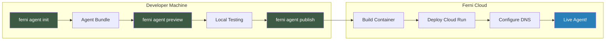

---

## 2. Agent Bundle Structure

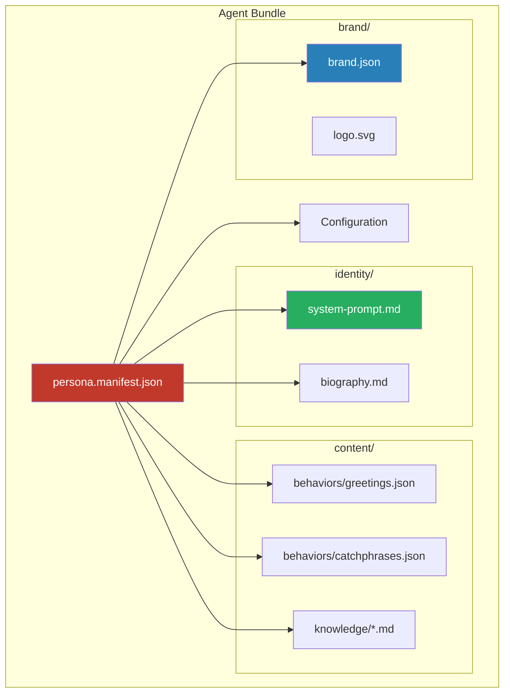

---

## 3. Voice Conversation Flow

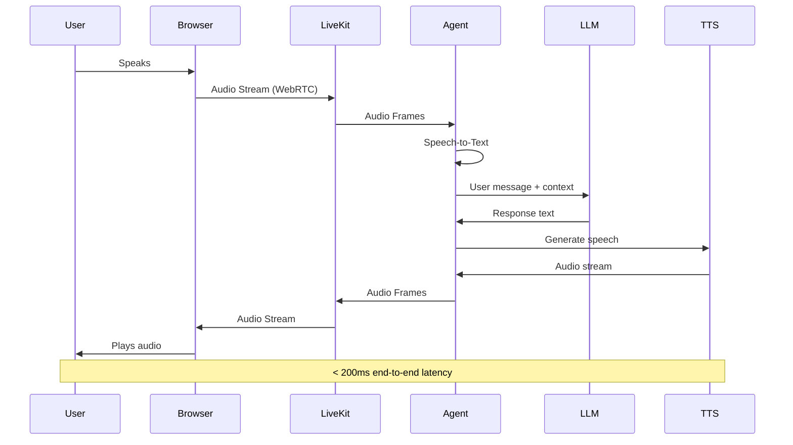

---

## 4. System Architecture

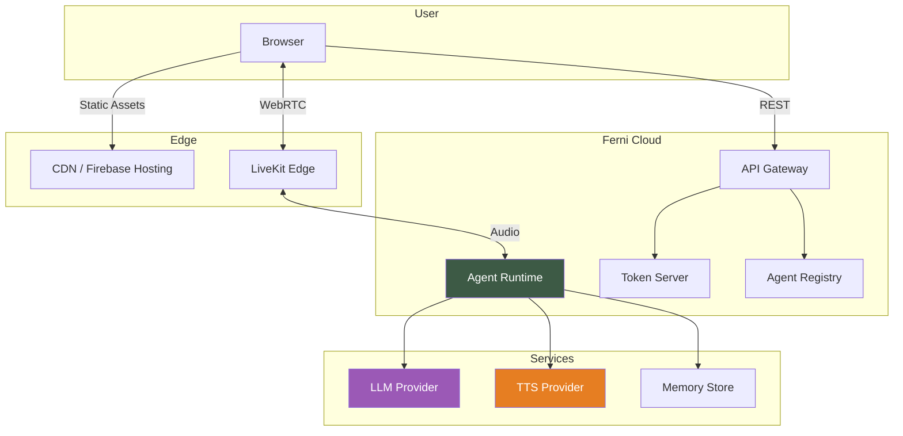

---

## 5. Local Development

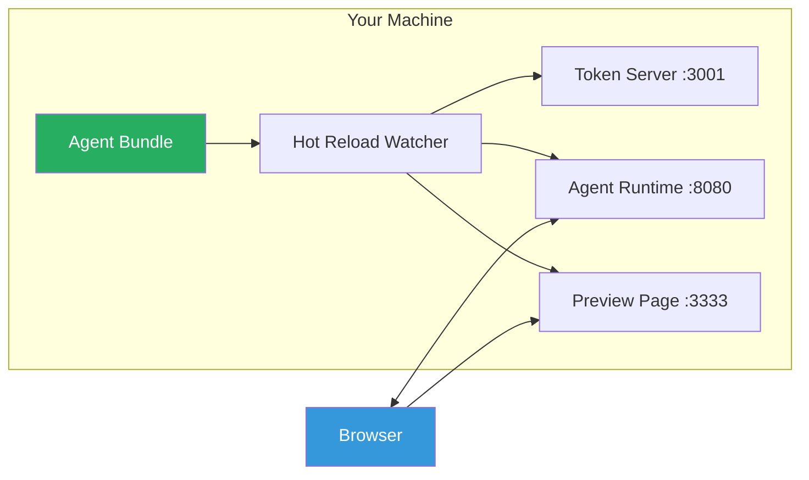

---

## 6. Deployment Pipeline

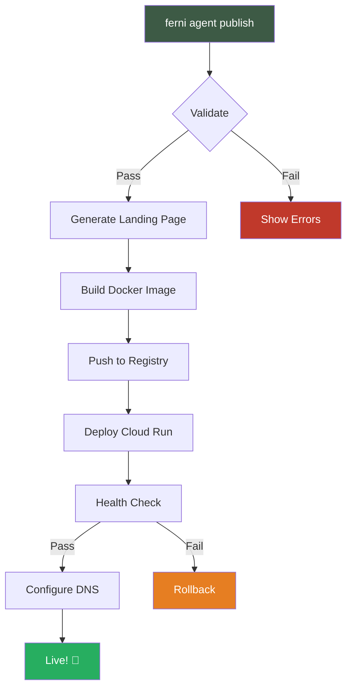

---

## 7. Multi-Agent Hosting

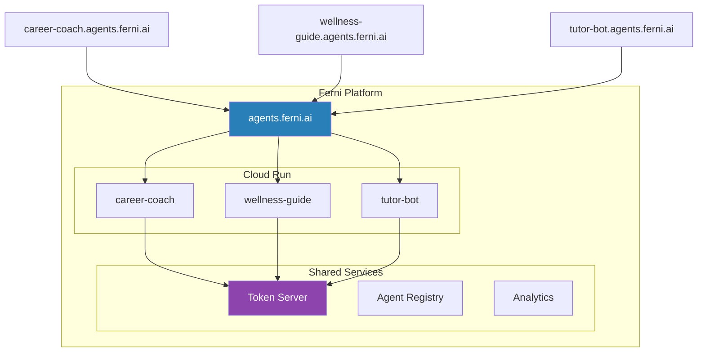

---

## 8. Authentication Flow

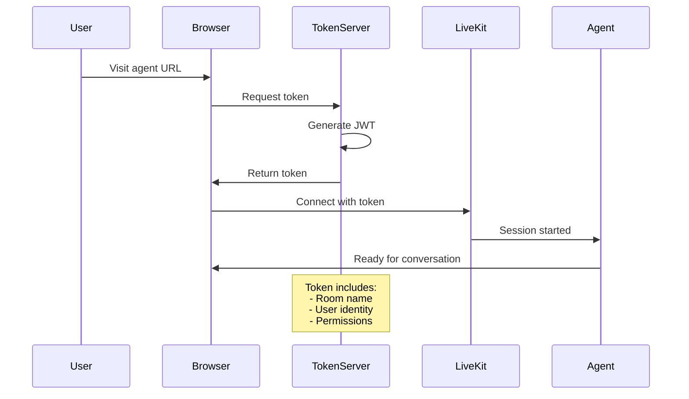

---

## 9. Cost Architecture

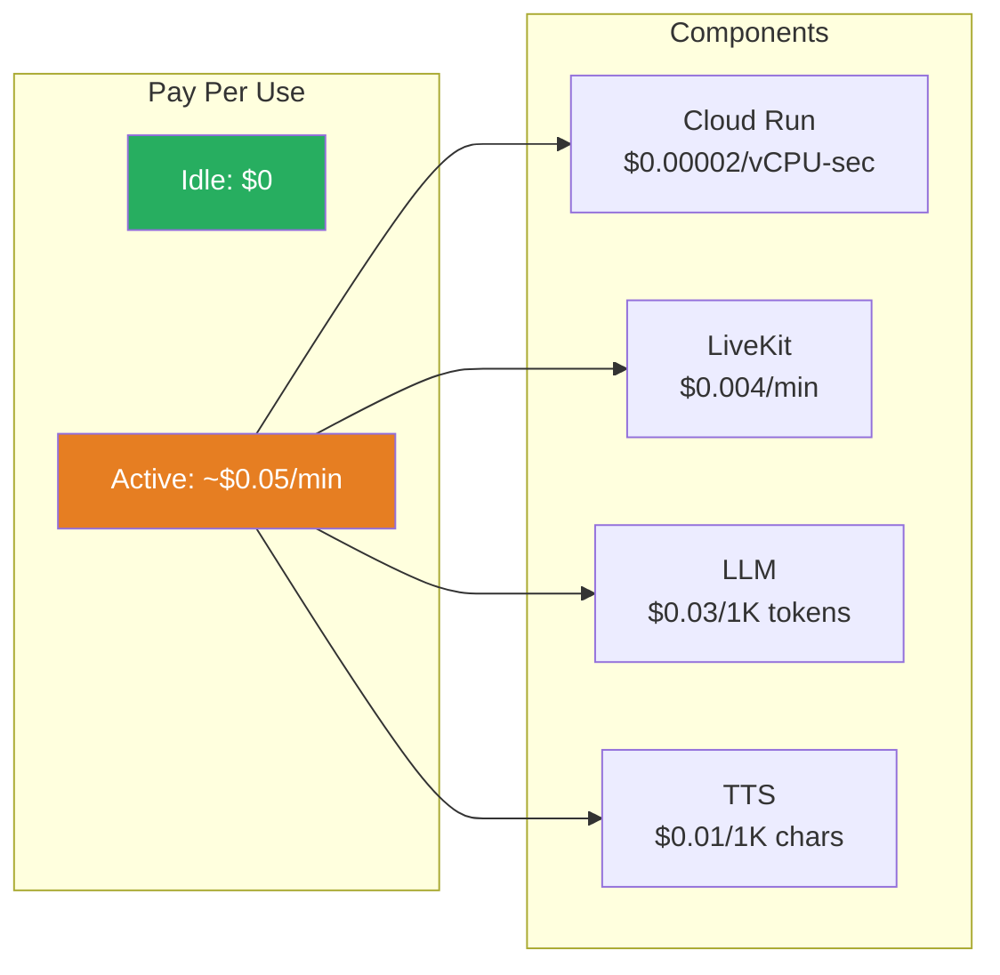

---

## 10. Scaling Behavior

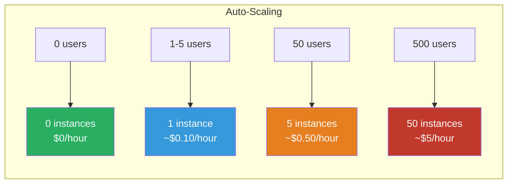

---

## Usage

### In Markdown Docs
```markdown
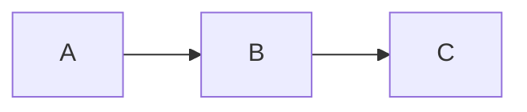
```

### In GitHub
GitHub renders Mermaid natively in markdown files.

### In Notion
Use the Mermaid embed block.

### Export to PNG/SVG
Use [Mermaid Live Editor](https://mermaid.live/) to export.

---

## Color Palette

| Color | Hex | Use |
|-------|-----|-----|
| Ferni Green | `#3d5a45` | Primary actions, CLI commands |
| Success | `#27ae60` | Completed, success states |
| Info | `#3498db` | Informational nodes |
| Warning | `#e67e22` | Caution, in-progress |
| Error | `#c0392b` | Errors, critical |
| Purple | `#8e44ad` | Services, infrastructure |

---

*Use these diagrams in docs, presentations, and landing pages.*
