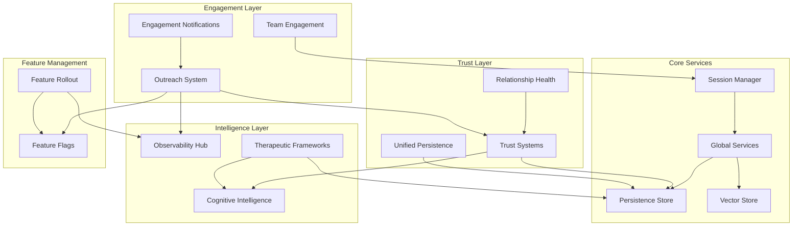

# Service Dependencies & Initialization Order

This document describes the dependencies between services and the required initialization order for the Ferni AI platform.

## Service Dependency Graph



## Initialization Order

Services must be initialized in this order to ensure dependencies are available:

### Phase 1: Core Infrastructure (Required)

| Order | Service           | Module                          | Dependencies |
| ----- | ----------------- | ------------------------------- | ------------ |
| 1.1   | Memory Store      | `memory/index.ts`               | None         |
| 1.2   | Vector Store      | `memory/index.ts`               | None         |
| 1.3   | Feature Flags     | `services/feature-flags.ts`     | None         |
| 1.4   | Observability Hub | `services/observability/hub.ts` | None         |

### Phase 2: Global Services (Required)

| Order | Service             | Module                                  | Dependencies    |
| ----- | ------------------- | --------------------------------------- | --------------- |
| 2.1   | Global Services     | `services/global-services.ts`           | Phase 1         |
| 2.2   | Productivity Store  | `services/productivity-store.ts`        | Global Services |
| 2.3   | Background Tasks    | `services/background-tasks.ts`          | Global Services |
| 2.4   | Collective Learning | `services/collective-learning-store.ts` | Global Services |

### Phase 3: Intelligence Layer (Required)

| Order | Service                | Module                                     | Dependencies           |
| ----- | ---------------------- | ------------------------------------------ | ---------------------- |
| 3.1   | Cognitive Intelligence | `services/cognitive-intelligence/index.ts` | Global Services        |
| 3.2   | Therapeutic Frameworks | `services/therapeutic-frameworks/index.ts` | Cognitive Intelligence |
| 3.3   | Context Builders       | `intelligence/context-builders/index.ts`   | Intelligence Layer     |

### Phase 4: Trust Layer (Required)

| Order | Service             | Module                                          | Dependencies           |
| ----- | ------------------- | ----------------------------------------------- | ---------------------- |
| 4.1   | Trust Systems       | `services/trust-systems/index.ts`               | Persistence, Cognitive |
| 4.2   | Unified Persistence | `services/trust-systems/unified-persistence.ts` | Trust Systems          |
| 4.3   | Relationship Health | `services/trust-systems/relationship-health.ts` | Trust Systems          |

### Phase 5: Engagement Layer (Optional)

| Order | Service                  | Module                                   | Dependencies                 |
| ----- | ------------------------ | ---------------------------------------- | ---------------------------- |
| 5.1   | Outreach System          | `services/outreach/index.ts`             | Trust Systems, Feature Flags |
| 5.2   | Team Engagement          | `services/engagement/team-engagement.ts` | Session Manager              |
| 5.3   | Engagement Notifications | `services/engagement-notifications.ts`   | Outreach                     |

### Phase 6: Feature Management (Optional)

| Order | Service         | Module                              | Dependencies                 |
| ----- | --------------- | ----------------------------------- | ---------------------------- |
| 6.1   | Feature Rollout | `services/feature-rollout.ts`       | Feature Flags, Observability |
| 6.2   | Trust Rollout   | `services/trust-systems/rollout.ts` | Feature Flags, Trust Systems |

## Service Categories

### Critical Services (Must be available)

These services are critical for basic operation:

1. **Persistence Store** - User data storage
2. **Session Manager** - Session lifecycle
3. **Feature Flags** - Feature gating
4. **Observability Hub** - Monitoring

### Important Services (Should be available)

These services enhance functionality but have fallbacks:

1. **Trust Systems** - Falls back to basic context
2. **Cognitive Intelligence** - Falls back to keyword matching
3. **Therapeutic Frameworks** - Falls back to generic responses

### Optional Services (Nice to have)

These services are optional and degrade gracefully:

1. **Outreach System** - Requires external credentials
2. **Voice Synthesis** - Requires Cartesia API
3. **SIP Bridge** - Requires Twilio configuration

## Health Check Integration

Each service should implement health checks:

```typescript
import { runAllHealthChecks, runCriticalHealthChecks } from './services/index.js';

// Full health check (all services)
const fullReport = await runAllHealthChecks();
console.log(fullReport.overall); // 'healthy' | 'degraded' | 'unhealthy'

// Critical checks only (faster, for frequent polling)
const criticalReport = await runCriticalHealthChecks();
```

## Error Handling

### Initialization Failures

When a service fails to initialize:

1. **Critical Services**: Throw error, prevent startup
2. **Important Services**: Log warning, continue with fallback
3. **Optional Services**: Log debug, disable feature

### Runtime Failures

When a service fails during runtime:

1. **Circuit Breaker**: Prevent cascade failures
2. **Fallback**: Use degraded mode
3. **Alert**: Notify via observability

## Environment Requirements

### Required Environment Variables

```bash
# Core (always required)
NODE_ENV=production|development|test

# Persistence (one required)
GOOGLE_CLOUD_PROJECT=your-project-id
# OR
DATABASE_URL=postgres://...

# LLM (one required)
GOOGLE_API_KEY=your-key
# OR
OPENAI_API_KEY=your-key
```

### Optional Environment Variables

```bash
# Voice
LIVEKIT_URL=wss://your-livekit.livekit.cloud
LIVEKIT_API_KEY=your-key
LIVEKIT_API_SECRET=your-secret

# TTS
CARTESIA_API_KEY=your-key

# Outreach
TWILIO_ACCOUNT_SID=your-sid
TWILIO_AUTH_TOKEN=your-token
SENDGRID_API_KEY=your-key

# Feature Flags
FEATURE_FLAG_SOURCE=firestore|env|local
```

## Testing Service Dependencies

### Unit Tests

Test services in isolation with mocked dependencies:

```typescript
import { vi } from 'vitest';

vi.mock('../services/persistence', () => ({
  getStore: () => mockStore,
}));
```

### Integration Tests

Test service interactions:

```typescript
import { describe, it } from 'vitest';
import { initializeServices } from '../services/index.js';

describe('Services Integration', () => {
  it('should initialize all services in correct order', async () => {
    const services = await initializeServices(false);
    expect(services.initialized).toBe(true);
  });
});
```

### E2E Tests

Test full user journeys across services:

```bash
npm run test:e2e
npx tsx scripts/test-e2e.ts
```

## Monitoring

### Health Endpoints

- `/health` - Basic liveness check
- `/health/ready` - Readiness (all critical services)
- `/health/full` - Full service status

### Metrics

Key metrics to monitor:

1. Service initialization time
2. Health check latency
3. Error rates per service
4. Circuit breaker state

### Alerts

Configure alerts for:

1. Service unhealthy > 5 minutes
2. Initialization failure
3. Circuit breaker open
4. High error rate
