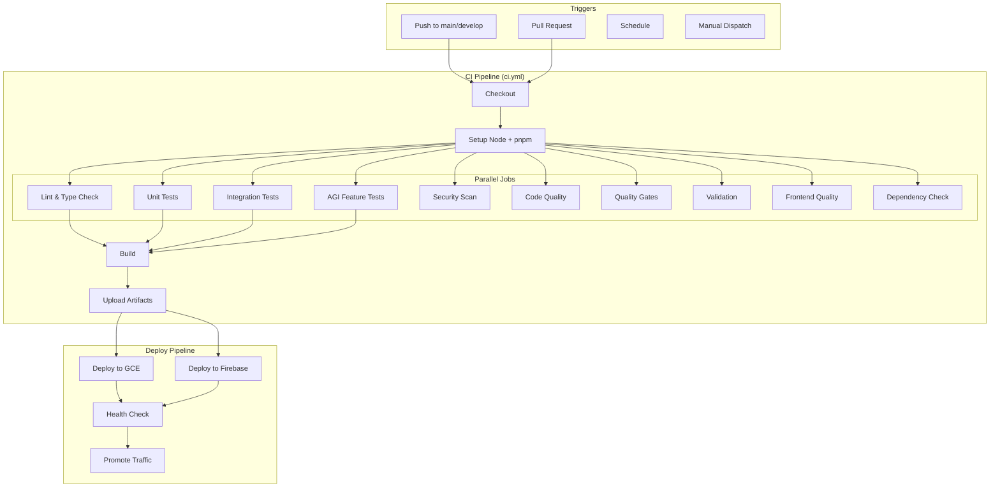
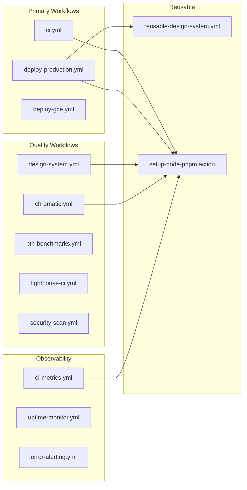

# CI/CD Architecture - Current State

This document describes the current CI/CD architecture after the 2026-01 optimization.

## Overview Diagram



## Component Details

### Composite Action

```
.github/actions/setup-node-pnpm/action.yml
├── Setup pnpm (v10)
├── Setup Node.js (v20)
├── Fix local dependencies
└── Install dependencies
```

### Path Filters

```yaml
paths:
  - 'src/**'
  - 'apps/**'
  - 'packages/**'
  - 'design-system/**'
  - 'package.json'
  - 'pnpm-lock.yaml'
  - 'tsconfig*.json'
  - '.github/workflows/ci.yml'
  - '.github/actions/**'
```

### Concurrency Control

```yaml
concurrency:
  group: ci-${{ github.workflow }}-${{ github.ref }}
  cancel-in-progress: true
```

## Workflow Relationships



## Runner Configuration

| Workflow | Runner | Reason |
|----------|--------|--------|
| ci.yml | self-hosted (GCE) | Fast, no queue |
| deploy-gce.yml | self-hosted (GCE) | Direct VM access |
| Others | ubuntu-latest | Simple, reliable |

## Secrets Used

| Secret | Workflows |
|--------|-----------|
| GITHUB_TOKEN | All |
| CODECOV_TOKEN | ci.yml |
| GCP_SA_KEY | deploy-*.yml |
| LIVEKIT_* | ci.yml, deploy-gce.yml |
| SLACK_WEBHOOK_URL | ci-metrics.yml, bth-benchmarks.yml |

## Optimization Summary

| Before | After | Improvement |
|--------|-------|-------------|
| No path filters | Path filters on all source | 70% fewer runs |
| No concurrency | Cancel in-progress | No pile-up |
| 11 independent installs | Composite action | DRY, consistent |
| pnpm v9/npm mix | pnpm v10 everywhere | No drift |
| 551 line ci.yml | 330 line ci.yml | 40% reduction |
