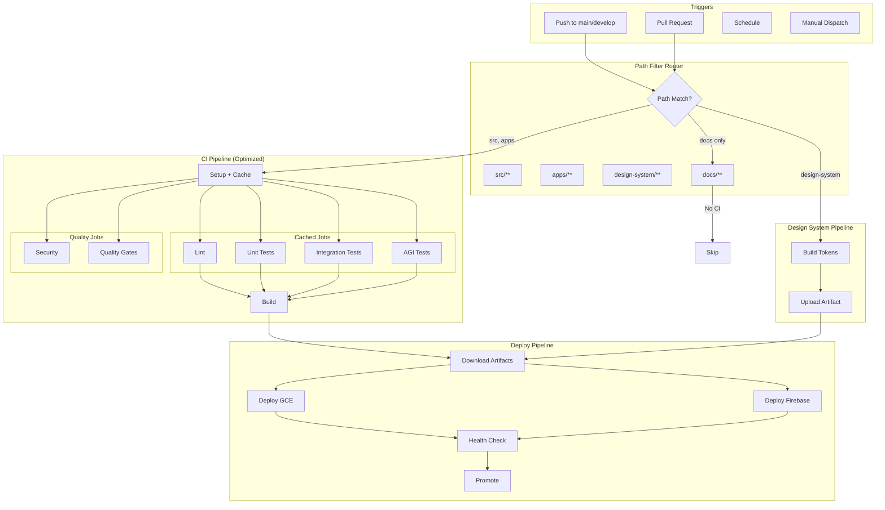

# CI/CD Architecture - Target State

This document describes the target CI/CD architecture with all planned optimizations.

## Target Overview



## Target Optimizations

### 1. Shared Setup Job

First job caches node_modules for reuse:

```yaml
jobs:
  setup:
    runs-on: [self-hosted, Linux, X64, gce]
    steps:
      - uses: actions/checkout@v4
      - uses: ./.github/actions/setup-node-pnpm
      - uses: actions/cache/save@v4
        with:
          path: node_modules
          key: node-modules-${{ hashFiles('pnpm-lock.yaml') }}

  lint:
    needs: setup
    steps:
      - uses: actions/checkout@v4
      - uses: actions/cache/restore@v4
        with:
          path: node_modules
          key: node-modules-${{ hashFiles('pnpm-lock.yaml') }}
      - run: pnpm lint
```

### 2. Reusable Design System

Design system builds once and shares artifact:

```yaml
jobs:
  design-system:
    uses: ./.github/workflows/reusable-design-system.yml

  build:
    needs: design-system
    steps:
      - uses: actions/download-artifact@v4
        with:
          name: ${{ needs.design-system.outputs.artifact-name }}
```

### 3. Affected-Only Testing (Future)

With Nx or custom detection:

```yaml
  test:
    steps:
      - name: Determine affected packages
        id: affected
        run: |
          AFFECTED=$(npx nx print-affected --type=lib --base=main)
          echo "packages=$AFFECTED" >> $GITHUB_OUTPUT

      - name: Run affected tests
        if: steps.affected.outputs.packages != ''
        run: npx nx affected:test --base=main
```

### 4. Conditional Platform Builds

macOS/iOS only on release:

```yaml
  ios-build:
    if: startsWith(github.ref, 'refs/tags/v')
    runs-on: macos-latest
    steps:
      - run: xcodebuild ...
```

## Target Metrics

| Metric | Current | Target |
|--------|---------|--------|
| CI time | 10 min | 6 min |
| Monthly minutes | 2,200 | 1,500 |
| Unnecessary runs | 30% | 5% |
| Cache hit rate | 70% | 95% |

## Migration Path

### Phase 1 (Complete)
- [x] Path filters
- [x] Concurrency control
- [x] Composite action
- [x] pnpm v10

### Phase 2 (Next)
- [ ] Shared setup job with cache
- [ ] Reusable design system workflow
- [ ] Conditional macOS builds

### Phase 3 (Future)
- [ ] Affected-only testing
- [ ] Distributed caching
- [ ] Preview environments

## Risk Mitigation

| Risk | Mitigation |
|------|------------|
| Cache invalidation | Include lockfile hash |
| Reusable workflow breaks | Test in isolated branch |
| Affected detection wrong | Fall back to full test |

## Success Criteria

1. CI under 3,000 min/month
2. PR feedback under 10 min
3. No workflow failures from infra
4. Developer satisfaction improved
