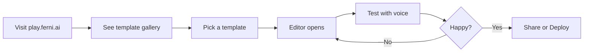
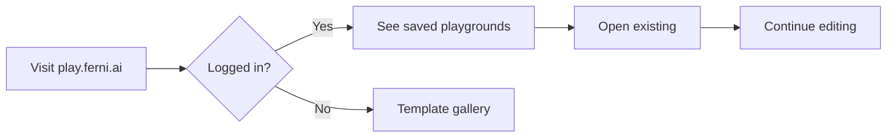

# Live Playground Specification

> **Browser-based playground for experimenting with Ferni agents without any local setup.**

---

## Overview

### URL
`https://play.ferni.ai`

### Concept
"CodePen for voice AI" - instantly create, test, and share voice agents in your browser.

---

## Features

### 1. No Setup Required

- No CLI installation
- No local development
- Just open the URL and start building

### 2. Split-Pane Editor

```
┌────────────────────────────────────────────────────────────────────┐
│  🎙️ Ferni Playground                      [Save] [Share] [Deploy] │
├─────────────────────────────────┬──────────────────────────────────┤
│                                 │                                  │
│  📄 system-prompt.md            │        🔊 Preview                │
│  ─────────────────────────      │                                  │
│  # Career Coach                 │   ┌──────────────────────┐      │
│                                 │   │                      │      │
│  You are Alex, a career         │   │    (((  👤  )))     │      │
│  coach who helps engineers...   │   │                      │      │
│                                 │   │   "Hey! I'm Alex,    │      │
│                                 │   │    your career       │      │
│                                 │   │    coach."           │      │
│                                 │   │                      │      │
│  ## Your Style                  │   │   [🎤 Start Talking] │      │
│  - Ask clarifying questions     │   └──────────────────────┘      │
│  - Use frameworks               │                                  │
│  - Celebrate wins               │   📊 Stats                       │
│                                 │   ───────────────                │
│                                 │   Latency: 180ms                 │
│                                 │   Tokens: 1,234                  │
│                                 │   Duration: 2m 15s               │
│                                 │                                  │
├─────────────────────────────────┴──────────────────────────────────┤
│  📁 Files: [system-prompt.md] [manifest.json] [greetings.json] +   │
└────────────────────────────────────────────────────────────────────┘
```

### 3. Instant Voice Preview

- Talk to your agent in real-time
- Changes apply immediately (no save needed)
- Voice waveform visualization
- Latency and token metrics

### 4. Template Gallery

```
┌────────────────────────────────────────────────────────────────────┐
│  🎨 Start from a Template                                          │
├────────────────────────────────────────────────────────────────────┤
│                                                                     │
│  ┌─────────────┐  ┌─────────────┐  ┌─────────────┐                │
│  │ 🎓 Mentor   │  │ 💼 Support  │  │ 🏃 Coach    │                │
│  │             │  │             │  │             │                │
│  │ Life advice │  │ Customer    │  │ Accountability│               │
│  │ and growth  │  │ questions   │  │ partner     │                │
│  │             │  │             │  │             │                │
│  │ [Use]       │  │ [Use]       │  │ [Use]       │                │
│  └─────────────┘  └─────────────┘  └─────────────┘                │
│                                                                     │
│  ┌─────────────┐  ┌─────────────┐  ┌─────────────┐                │
│  │ 📚 Tutor    │  │ 🧘 Wellness │  │ 🎨 Creative │                │
│  │             │  │             │  │             │                │
│  │ Subject     │  │ Mental      │  │ Brainstorm  │                │
│  │ expert      │  │ wellness    │  │ partner     │                │
│  │             │  │             │  │             │                │
│  │ [Use]       │  │ [Use]       │  │ [Use]       │                │
│  └─────────────┘  └─────────────┘  └─────────────┘                │
│                                                                     │
│  [Blank] - Start from scratch                                      │
│                                                                     │
└────────────────────────────────────────────────────────────────────┘
```

### 5. Share & Fork

```
Share Link: https://play.ferni.ai/p/abc123xyz

[Copy Link] [Download Bundle] [Deploy to Ferni]

Anyone with the link can:
○ View and test the agent
○ Fork to create their own version
○ Deploy to their account
```

### 6. Voice Selection

```
┌─ 🔊 Voice Settings ─────────────────────────────────────┐
│                                                          │
│  Voice: [▼ Calm British Man              ]              │
│                                                          │
│  ┌──────────────────────────────────────────────────┐   │
│  │ 🔊 Preview: "Hello! I'm here to help you today." │   │
│  │ [▶ Play]                                          │   │
│  └──────────────────────────────────────────────────┘   │
│                                                          │
│  ○ Warm Female - Friendly, approachable                 │
│  ● Calm British Man - Composed, professional            │
│  ○ Energetic Coach - Motivating, upbeat                 │
│  ○ Wise Elder - Thoughtful, measured                    │
│                                                          │
└──────────────────────────────────────────────────────────┘
```

### 7. Personality Sliders

```
┌─ 🎭 Personality ────────────────────────────────────────┐
│                                                          │
│  Warmth        ◯─────────●───── 0.8                     │
│                cold              warm                    │
│                                                          │
│  Directness    ◯───────●─────── 0.6                     │
│                gentle            blunt                   │
│                                                          │
│  Energy        ◯───────●─────── 0.6                     │
│                calm              energetic               │
│                                                          │
│  Humor         ◯───●─────────── 0.3                     │
│                serious           playful                 │
│                                                          │
└──────────────────────────────────────────────────────────┘
```

---

## User Flow

### First Visit



### Returning User



---

## Technical Architecture

### Frontend
- React/Next.js
- Monaco Editor (VS Code editor component)
- LiveKit React SDK
- Real-time WebSocket sync

### Backend
- Ephemeral agent instances (Cloud Run)
- Redis for session state
- Playground persistence (Firestore)
- Rate limiting (100 min/day for anonymous)

### Infrastructure
```
┌─────────────────────────────────────────────────────────────────┐
│                         play.ferni.ai                           │
├─────────────────────────────────────────────────────────────────┤
│                                                                  │
│   Browser ──────> Next.js App ──────> API Routes                │
│      │                                    │                      │
│      │ WebSocket                          │ REST                 │
│      ▼                                    ▼                      │
│   LiveKit <────────────────────> Ephemeral Agent                │
│   (WebRTC)                       (Cloud Run)                     │
│                                       │                          │
│                                       ▼                          │
│                              [LLM] [TTS] [Memory]               │
│                                                                  │
└─────────────────────────────────────────────────────────────────┘
```

---

## Limitations (Free Tier)

| Limit | Value | Pro |
|-------|-------|-----|
| Session time | 5 min max | 30 min |
| Daily usage | 100 min | 1,000 min |
| Save playgrounds | 3 | Unlimited |
| Custom voice | No | Yes |
| Deploy | Manual | One-click |

---

## File Types

### system-prompt.md
Primary editor tab - the agent's brain.

### manifest.json
Configuration (voice, personality, tools).

### greetings.json
How the agent says hello.

### + Add File
- catchphrases.json
- knowledge.md
- Custom files

---

## URL Structure

```
play.ferni.ai                    # New playground
play.ferni.ai/p/abc123           # Saved playground
play.ferni.ai/p/abc123/edit      # Edit mode
play.ferni.ai/t/mentor           # Template preview
play.ferni.ai/share/abc123       # Public share link
```

---

## Embed Widget

```html
<!-- Embed a playground on your docs site -->
<iframe 
  src="https://play.ferni.ai/embed/abc123"
  width="100%"
  height="600"
  frameborder="0"
></iframe>
```

---

## Export Options

### Download Bundle
```bash
my-agent/
├── persona.manifest.json
├── identity/
│   └── system-prompt.md
└── content/
    └── behaviors/
        └── greetings.json
```

### Deploy to Ferni
- One-click deploy from playground
- Requires Ferni account
- Auto-provisions subdomain

### Export to GitHub
- Creates new repo from playground
- Includes GitHub Actions for deployment

---

## Keyboard Shortcuts

| Shortcut | Action |
|----------|--------|
| `Cmd+Enter` | Start voice conversation |
| `Cmd+S` | Save playground |
| `Cmd+Shift+S` | Save as new |
| `Cmd+E` | Toggle editor/preview |
| `Cmd+1/2/3` | Switch file tabs |
| `Esc` | Stop conversation |

---

## Analytics

Track:
- Playgrounds created (by template)
- Conversation duration
- Conversion to sign-up
- Deploy rate
- Share rate

---

## Pricing Integration

```
┌─────────────────────────────────────────────────────────────────┐
│  ⏱️ You've used 80/100 free minutes today                       │
│                                                                  │
│  [Sign up for Pro] - 1,000 min/month, unlimited saves           │
│  [Continue with limits]                                          │
└─────────────────────────────────────────────────────────────────┘
```

---

## Development Phases

### Phase 1: MVP (3 weeks)
- [ ] Basic editor with system-prompt.md
- [ ] Voice preview (single voice)
- [ ] Template gallery (3 templates)
- [ ] Save/share links
- [ ] Anonymous usage tracking

### Phase 2: Polish (2 weeks)
- [ ] All file types
- [ ] Voice selection
- [ ] Personality sliders
- [ ] Embed widget
- [ ] Better error handling

### Phase 3: Advanced (2 weeks)
- [ ] User accounts & saved playgrounds
- [ ] One-click deploy
- [ ] GitHub export
- [ ] Analytics dashboard
- [ ] Pro tier integration

---

## Marketing

### Landing Page Copy
```
# Try Before You Install

No CLI. No setup. Just build.

Create a voice AI agent in your browser, test it with your voice,
and share it with a link.

[Open Playground]

Used by developers at Google, Meta, and Stripe.
```

### Use Cases
- "Try Ferni in 30 seconds"
- "Prototype before committing"
- "Share agent ideas with your team"
- "Embed in documentation"

---

*The playground is the lowest-friction entry point to Ferni*
